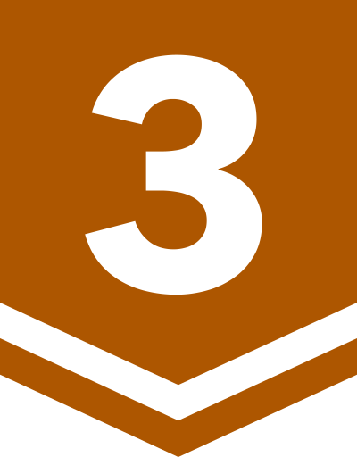

# 알고리즘 
다양한 알고리즘 문제를 해결합니다.  
  
wsl에서 vim을 사용하여 코드를 작성하며, shell script로 문제 파일 작성과 풀이 시간 계산을 자동화하고 있습니다.  
이에 대한 내용은 [여기](https://sabujak.tistory.com/18)를 참고해주세요.  

문제 완료 기호

🟢 = 성공 
🔴 = 틀렸으니까 다시 확인하기 
🟡 = 맞았지만 다시 확인하기 
⚫ = 이전에 🔴 또는 🟡이었지만 확인 완료

## 목차

- 도서
  - [이것이 취업을 위한 코딩 테스트다 with 파이썬](#이것이-취업을-위한-코딩-테스트다-with-파이썬)
  - [알고리즘 문제 해결 전략](#알고리즘-문제-해결-전략)
- 온라인 플랫폼
  - [백준](#백준)
  - [프로그래머스](#프로그래머스)  

## 알고리즘 문제 해결 전략
### 무식하게 풀기
|난이도|문제 이름|풀이 시간|날짜|완료|
|:---:|:---:|:---:|:---:|:---:|
|하|[소풍](/알고리즘%20문제%20해결%20전략/소풍/22%2D01%2D29%2Epy)|2시간|2022년 1월 29일|🟢|
|하|[게임판 덮기](/알고리즘%20문제%20해결%20전략/게임판%20덮기/22%2D01%2D29%2Epy)|2시간|2022년 1월 29일|⚫|
|하|[게임판 덮기](알고리즘%20문제%20해결%20전략/게임판%20덮기/2022-03-06.py)|2시간|2022년 1월 29일|🟡|
|하|[시계 맞추기](/알고리즘%20문제%20해결%20전략/시계%20맞추기/22%2D01%2D29%2Epy)|1시간|2022년 1월 29일|🔴|
### 분할 정복
|난이도|문제 이름|풀이 시간|날짜|완료|
|:---:|:---:|:---:|:---:|:---:|
|하|[쿼드 트리 뒤집기](/알고리즘%20문제%20해결%20전략/쿼드%20트리%20뒤집기/2022-02-01.py)|1시간 30분|2022년 2월 1일|🟢|
|중|[울타리 잘라내기](/알고리즘%20문제%20해결%20전략/울타리%20잘라내기/22-02-01.py)|30분|2022년 2월 1일|🟡|
|하|[조세푸스 문제](/알고리즘%20문제%20해결%20전략/조세푸스%20문제/2022-02-02.py)|1시간|2022년 2월 2일|🟡|
### 동적 계획법 
|난이도|문제 이름|풀이 시간|날짜|완료|
|:---:|:---:|:---:|:---:|:---:|
|중|[와일드카드](/알고리즘%20문제%20해결%20전략/와일드카드/2022-10-20.py)|1시간 30분|2022년 10월 20일|🔴|
### 트리의 구현과 순회
|난이도|문제 이름|풀이 시간|날짜|완료|
|:---:|:---:|:---:|:---:|:---:|
|하|[트리 순회 순서 변경](/알고리즘%20문제%20해결%20전략/트리%20순회%20순서%20변경/2022-02-14.py)|30분|2022년 2월 14일|🟡|
|중|[요새](/알고리즘%20문제%20해결%20전략/요새/2022-02-14.py)|30분|2022년 2월 14일|⚫|
|중|[요새](/알고리즘%20문제%20해결%20전략/요새/2022-02-19.py)|1시간 30분|2022년 2월 19일|🟢|
### 큐와 스택, 데크
|난이도|문제 이름|풀이 시간|날짜|완료|
|:---:|:---:|:---:|:---:|:---:|
|하|[짝이 맞지 않는 괄호](/알고리즘%20문제%20해결%20전략/짝이%20맞지%20않는%20괄호/2022-02-05.py)|20분|2022년 2월 5일|🟢|
|중|[외계 신호 분석](/알고리즘%20문제%20해결%20전략/외계%20신호%20분석/2022-02-05.py)|40분|2022년 2월 5일|🟢|
### 수치 해석
|난이도|문제 이름|풀이 시간|날짜|완료|
|:---:|:---:|:---:|:---:|:---:|
|하|[승률 올리기](/알고리즘%20문제%20해결%20전략/승률%20올리기/2022-03-03.py)|1시간|2022년 3월 3일|🟢|
### 구간 트리
|난이도|문제 이름|풀이 시간|날짜|완료|
|:---:|:---:|:---:|:---:|:---:|
|중|[등산로](/알고리즘%20문제%20해결%20전략/등산로/2022-05-24.py)|3시간|2022년 5월 24일|🟢|
### 상호 배타적 집합 
|난이도|문제 이름|풀이 시간|날짜|완료|
|:---:|:---:|:---:|:---:|:---:|
|중|[에디터 전쟁](/알고리즘%20문제%20해결%20전략/에디터%20전쟁/2022-09-23.py)|1시간 10분|2022년 9월 23일|🔴|
### 그래프의 깊이 우선 탐색
|난이도|문제 이름|풀이 시간|날짜|완료|
|:---:|:---:|:---:|:---:|:---:|
|하|[고대어 사전](/알고리즘%20문제%20해결%20전략/고대어%20사전/2022-09-13.py)|1시간 20분|2022년 9월 13일|🟡|
### 최단 경로 알고리즘
|난이도|문제 이름|풀이 시간|날짜|완료|
|:---:|:---:|:---:|:---:|:---:|
|하|[신호 라우팅](/알고리즘%20문제%20해결%20전략/신호%20라우팅/2022-09-19.py)|30분|2022년 9월 19일|🟢|
|중|[소방차](/알고리즘%20문제%20해결%20전략/소방차/2022-09-19.py)|50분|2022년 9월 19일|⚫|
|중|[소방차](/알고리즘%20문제%20해결%20전략/소방차/2022-09-21.py)|1시간 30분|2022년 9월 21일|🟢|
|상|[철인 N종 경기](/알고리즘%20문제%20해결%20전략/철인%20N종%20경기/2022-09-19.py)|2시간 30분|2022년 9월 19일|🟡|
|중|[음주 운전 단속](/알고리즘%20문제%20해결%20전략/음주%20운전%20단속/2022-09-23.py)|2시간|2022년 9월 22일|🟢|
|중|[선거 공약](/알고리즘%20문제%20해결%20전략/선거%20공약/2022-09-23.py)|40분|2022년 9월 23일|🟢|
### 최소 스패닝 트리 
|난이도|문제 이름|풀이 시간|날짜|완료|
|:---:|:---:|:---:|:---:|:---:|
|하|[근거리 네트워크](/알고리즘%20문제%20해결%20전략/근거리%20네트워크/2022-09-23.py)|40분|2022년 9월 23일|🟢|

<a href="#목차">▲목차</a>
  

## 이것이 취업을 위한 코딩 테스트다 with 파이썬
### 그리디
|난이도|문제 이름|풀이 시간|날짜|완료|
|:---:|:---:|:---:|:---:|:---:|
|1|[큰 수의 법칙](/이것이%20취업을%20위한%20코딩%20테스트다/그리디/큰%20수의%20법칙.py)|20분|2022년 3월 22일|🟢|
|1|[숫자 카드 게임](/이것이%20취업을%20위한%20코딩%20테스트다/그리디/큰%20수의%20법칙.py)|5분|2022년 3월 22일|🟢|
|1|[1이 될 때까지](/이것이%20취업을%20위한%20코딩%20테스트다/그리디/1이%20될%20때까지.py)|20분|2022년 3월 22일|🟢|
|1|[모험가 길드](/이것이%20취업을%20위한%20코딩%20테스트다/모험가%20길드.py)|45분|2022년 3월 22일|⚫|
|1|[모험가 길드](/이것이%20취업을%20위한%20코딩%20테스트다/그리디/모험가%20길드2.py)|20분|2022년 3월 24일|⚫|
|1|[모험가 길드](/이것이%20취업을%20위한%20코딩%20테스트다/그리디/모험가%20길드3.py)|40분|2022년 3월 30일|🟢|
|1|[곱하기 혹은 더하기](/이것이%20취업을%20위한%20코딩%20테스트다/그리디/곱하기%20혹은%20더하기.py)|2분|2022년 3월 23일|🟢|
|1|[문자열 뒤집기](/이것이%20취업을%20위한%20코딩%20테스트다/그리디/문자열%20뒤집기.py)|5분|2022년 3월 23일|🟢|
|1|[만들 수 없는 금액](/이것이%20취업을%20위한%20코딩%20테스트다/그리디/만들%20수%20없는%20금액.py)|1시간|2022년 3월 23일|⚫|
|1|[만들 수 없는 금액](/이것이%20취업을%20위한%20코딩%20테스트다/그리디/만들%20수%20없는%20금액2.py)|20분|2022년 3월 24일|🟢|
|1|[볼링공 고르기](/이것이%20취업을%20위한%20코딩%20테스트다/그리디/볼링공%20고르기.py)|20분|2022년 3월 23일|⚫|
|1|[볼링공 고르기](/이것이%20취업을%20위한%20코딩%20테스트다/그리디/볼링공%20고르기2.py)|30분|2022년 3월 30일|🟢|
### 구현
|난이도|문제 이름|풀이 시간|날짜|완료|
|:---:|:---:|:---:|:---:|:---:|
|1|[왕실의 나이트](/이것이%20취업을%20위한%20코딩%20테스트다/구현/왕실의%20나이트.py)|15분|2022년 3월 23일|🟢|
|2|[게임 개발](/이것이%20취업을%20위한%20코딩%20테스트다/구현/게임%20개발.py)|1시간|2022년 3월 23일|⚫|
|2|[게임 개발](/이것이%20취업을%20위한%20코딩%20테스트다/구현/게임%20개발(2).py)|50분|2022년 11월 16일|🟢|
|1|[럭키 스트레이트](/이것이%20취업을%20위한%20코딩%20테스트다/구현/럭키%20스트레이트.py)|2분|2022년 3월 24일|🟢|
|1|[문자열 재정렬](/이것이%20취업을%20위한%20코딩%20테스트다/구현/문자열%20재정렬.py)|10분|2022년 3월 24일|🟢|
|1.5|[문자열 압축](/이것이%20취업을%20위한%20코딩%20테스트다/구현/문자열%20압축.py)|1시간 10분|2022년 3월 28일|🔴|
|2|[뱀](/이것이%20취업을%20위한%20코딩%20테스트다/구현/뱀.py)|1시간 40분|2022년 3월 28일|🟢|
|2|[치킨 배달](/이것이%20취업을%20위한%20코딩%20테스트다/구현/치킨%20배달.py)|50분|2022년 3월 28일|🟢|
|1.5|[자물쇠와 열쇠](/이것이%20취업을%20위한%20코딩%20테스트다/구현/자물쇠와%20열쇠.py)|40분|2022년 4월 13일|🔴|
|1.5|[기둥과 보 설치](/이것이%20취업을%20위한%20코딩%20테스트다/구현/기둥과%20보%20설치.py)|1시간 10분|2022년 4월 13일|🟢|
|3|[외벽 점검](/이것이%20취업을%20위한%20코딩%20테스트다/구현/외벽%20점검.py)|30분|2022년 4월 13일|🔴|
### DFS/BFS
|난이도|문제 이름|풀이 시간|날짜|완료|
|:---:|:---:|:---:|:---:|:---:|
|1.5|[음료수 얼려 먹기](/이것이%20취업을%20위한%20코딩%20테스트다/DFS%20BFS/음료수%20얼려%20먹기.py)|50분|2022년 3월 25일|🟢|
|1.5|[미로 탈출](/이것이%20취업을%20위한%20코딩%20테스트다/DFS%20BFS/미로%20탈출.py)|50분|2022년 3월 25일|🟢|
|1.5|[특정 거리의 도시 찾기](/이것이%20취업을%20위한%20코딩%20테스트다/DFS%20BFS/특정%20거리의%20도시%20찾기.py)|20분|2022년 4월 4일|🟢|
|2|[경쟁적 전염](/이것이%20취업을%20위한%20코딩%20테스트다/DFS%20BFS/경쟁적%20전염.py)|30분|2022년 4월 5일|🟢|
|1|[괄호 변환](/이것이%20취업을%20위한%20코딩%20테스트다/DFS%20BFS/괄호%20변환.py)|40분|2022년 4월 5일|🟢|
|2.5|[감시 피하기](/이것이%20취업을%20위한%20코딩%20테스트다/DFS%20BFS/감시%20피하기.py)|30분|2022년 4월 5일|🟢|
### 정렬
|난이도|문제 이름|풀이 시간|날짜|완료|
|:---:|:---:|:---:|:---:|:---:|
|1|[위에서 아래로](/이것이%20취업을%20위한%20코딩%20테스트다/정렬/위에서%20아래로.py)|20분|2022년 3월 29일|🟢|
|1|[성적이 낮은 순서로 학생 출력하기](/이것이%20취업을%20위한%20코딩%20테스트다/정렬/성적이%20낮은%20순서로%20학생%20출력하기.py)|10분|2022년 11월 16일|🟢|
|1|[두 배열의 원소 교체](/이것이%20취업을%20위한%20코딩%20테스트다/정렬/두%20배열의%20원소%20교체.py)|20분|2022년 11월 16일|🟢|
### 이진 탐색
|난이도|문제 이름|풀이 시간|날짜|완료|
|:---:|:---:|:---:|:---:|:---:|
|1.5|[부품 찾기](/이것이%20취업을%20위한%20코딩%20테스트다/이진%20탐색/부품%20찾기.py)|20분|2022년 3월 30일|🟢|
|2|[떡볶이 떡 만들기](/이것이%20취업을%20위한%20코딩%20테스트다/이진%20탐색/떡볶이%20떡%20만들기.py)|15분|2022년 3월 30일|🟢|
### 다이나믹 프로그래밍
|난이도|문제 이름|풀이 시간|날짜|완료|
|:---:|:---:|:---:|:---:|:---:|
|1.5|[1로 만들기](/이것이%20취업을%20위한%20코딩%20테스트다/다이나믹%20프로그래밍/1로%20만들기.py)|10분|2022년 4월 1일|🟢|
|2|[개미 전사](/이것이%20취업을%20위한%20코딩%20테스트다/다이나믹%20프로그래밍/개미%20전사.py)|10분|2022년 4월 5일|🟢|
|1.5|[바닥 공사](/이것이%20취업을%20위한%20코딩%20테스트다/다이나믹%20프로그래밍/바닥%20공사.py)|20분|2022년 4월 7일|🟡|
|2|[효율적인 화폐 구성](/이것이%20취업을%20위한%20코딩%20테스트다/다이나믹%20프로그래밍/효율적인%20화폐%20구성.py)|10분|2022년 4월 7일|🟢|
### 최단 경로
|난이도|문제 이름|풀이 시간|날짜|완료|
|:---:|:---:|:---:|:---:|:---:|
|2|[미래 도시](/이것이%20취업을%20위한%20코딩%20테스트다/최단%20경로/미래%20도시.py)|20분|2022년 4월 8일|🟢|
|3|[전보](/이것이%20취업을%20위한%20코딩%20테스트다/최단%20경로/전보.py)|20분|2022년 4월 11일|🟢|
## 백준
### 다이나믹프로그래밍
|레벨|문제 번호|문제 이름|풀이 시간|날짜|완료|
|:---:|:---:|:---:|:---:|:---:|:---:|
||11053|[가장 긴 증가하는 부분 수열](/백준/다이나믹프로그래밍/가장%20긴%20증가하는%20부분%20수열.py)|2시간|2022년 3월 4일|🟢|
||14501|[퇴사](/백준/다이나믹프로그래밍/퇴사.py)|1시간 30분|2022년 9월 5일|🟢|
||2579|[계단 오르기](/백준/다이나믹프로그래밍/계단%20오르기.py)|1시간 40분|2022년 9월 9일|⚫|
||2293|[동전 1](/백준/다이나믹프로그래밍/동전%201.py)|1시간 30분|2022년 10월 1일|🟢|
||1912|[연속합](/백준/다이나믹프로그래밍/연속합.py)|30분|2022년 10월 20일|⚫|
||1912|[연속합](/백준/다이나믹프로그래밍/연속합(2).py)|20분|2022년 10월 21일|🟢|
||10844|[쉬운 계단 수](/백준/다이나믹프로그래밍/쉬운%20계단%20수.py)|40분|2022년 10월 20일|🟢|
||11727|[2xn 타일링 2](/백준/다이나믹프로그래밍/2xn%20타일링%202.py)|50분|2022년 10월 21일|🟢|
||1890|[점프](/백준/다이나믹프로그래밍/Problem1890.java)|2시간|2022년 11월 12일|⚫|
||1890|[점프](/백준/다이나믹프로그래밍/점프.py)|1시간|2022년 11월 24일|🟢|
||9465|[스티커](/백준/다이나믹프로그래밍/스티커.py)|30분|2022년 11월 17일|🟢|
||11057|[오르막 수](/백준/다이나믹프로그래밍/오르막%20수.py)|20분|2022년 11월 17일|🟢|
||2133|[타일 채우기](/백준/다이나믹프로그래밍/타일%20채우기.py)|1시간 10분|2022년 11월 24일|🟢|
||2011|[암호코드](/백준/다이나믹프로그래밍/암호코드.py)|50분|2022년 11월 24일|🟢|
||16639|[괄호 추가하기 3](/백준/다이나믹프로그래밍/괄호%20추가하기%203.py)|1시간|2022년 11월 28일|🟢|
||1965|[상자넣기](/백준/다이나믹프로그래밍/상자넣기.py)|10분|2022년 11월 30일|🟢|
||2294|[동전 2](/백준/다이나믹프로그래밍/동전%202.py)|50분|2022년 12월 6일|🟢|
||1520|[내리막 길](/백준/다이나믹프로그래밍/내리막%20길.py)|40분|2022년 12월 6일|🟢|
||2225|[합분해](/백준/다이나믹프로그래밍/합분해.py)|40분|2022년 12월 6일|🟢|
||11726|[2×n 타일링](/백준/다이나믹프로그래밍/2×n%20타일링.py)|20분|2023년 1월 4일|🟢|
### 그리디 알고리즘
|레벨|문제 번호|문제 이름|풀이 시간|날짜|완료|
|:---:|:---:|:---:|:---:|:---:|:---:|
||11399|[ATM](/백준/그리디%20알고리즘/ATM.py)|5분|2022년 3월 28일|🟢|
||13305|[주유소](/백준/그리디%20알고리즘/주유소.py)|20분|2022년 3월 28일|🟢|
||1026|[보물](/백준/그리디%20알고리즘/보물.py)|10분|2022년 10월 14일|🟢|
||2217|[로프](/백준/그리디%20알고리즘/로프.py)|20분|2022년 10월 18일|🟢|
||1789|[수들의 합](/백준/그리디%20알고리즘/수들의%20합.py)|20분|2022년 10월 19일|🟢|
||10610|[30](/백준/그리디%20알고리즘/30.py)|10분|2022년 10월 19일|🟢|
||1946|[신입 사원](/백준/그리디%20알고리즘/신입%20사원.py)|10분|2022년 10월 27일|🟢|
||17420|[깊콘이 넘쳐흘러](/백준/그리디%20알고리즘/깊콘이%20넘쳐흘러.py)|3시간|2022년 11월 1일|⚫|
||17420|[깊콘이 넘쳐흘러](/백준/그리디%20알고리즘/깊콘이%20넘쳐흘러(2).py)|2시간 30분|2022년 11월 22일|🟢|
||1459|[걷기](/백준/그리디%20알고리즘/Problem1459.java)|2시간 30분|2022년 11월 7일|🟢|
||1911|[흙길 보수하기](/백준/그리디%20알고리즘/Problem1911.java)|1시간 20분|2022년 11월 10일|🟢|
||1781|[컵라면](/백준/그리디%20알고리즘/컵라면.py)|1시간 50분|2022년 11월 22일|⚫|
||1802|[종이 접기](/백준/그리디%20알고리즘/종이%20접기.py)|3시간 30분|2022년 11월 22일|🟢|
||2012|[등수 매기기](/백준/그리디%20알고리즘/등수%20매기기.py)|10분|2022년 11월 22일|🟢|
||1543|[문서 검색](/백준/그리디%20알고리즘/문서%20검색.py)|10분|2022년 11월 22일|🟢|
||2212|[센서](/백준/그리디%20알고리즘/센서.py)|1시간 10분|2022년 11월 23일|🟢|
||2885|[초콜릿 식사](/백준/그리디%20알고리즘/초콜릿%20식사.py)|30분|2022년 11월 23일|🟢|
||12018|[Yonsei TOTO](/백준/그리디%20알고리즘/Yonsei%20TOTO.py)|30분|2022년 11월 23일|🟢|
||1202|[보석 도둑](/백준/그리디%20알고리즘/보석%20도둑.py)|30분|2022년 11월 23일|🔴|
### 스택
|레벨|문제 번호|문제 이름|풀이 시간|날짜|완료|
|:---:|:---:|:---:|:---:|:---:|:---:|
||10828|[스택](백준/스택/스택.py)|10분|2022년 2월 5일|🟢|
||10773|[제로](백준/스택/제로.py)|5분|2022년 2월 5일|🟢|
||1874|[스택 수열](백준/스택/스택%20수열.py)|1시간|2022년 2월 5일|🟢|
||17298|[오큰수](백준/스택/오큰수.py)|15분|2022년 2월 18일|🟢|
||9012|[괄호](백준/스택/괄호.py)|10분|2022년 8월 30일|🟢|
### 큐 
|레벨|문제 번호|문제 이름|풀이 시간|날짜|완료|
|:---:|:---:|:---:|:---:|:---:|:---:|
||2164|[카드2](백준/큐/카드2.py)|10분|2022년 11월 26일|🟢|
### 분할 정복
|레벨|문제 번호|문제 이름|풀이 시간|날짜|완료|
|:---:|:---:|:---:|:---:|:---:|:---:|
||2630|[색종이 만들기](백준/분할%20정복/색종이%20만들기.py)|1시간|2022년 2월 21일|🟢|
||10830|[행렬 제곱](백준/분할%20정복/행렬%20제곱.py)|1시간|2022년 2월 21일|🟢|
||1629|[곱셈](백준/분할%20정복/곱셈.py)|10분|2022년 2월 22일|🟢|
||9253|[별 찍기 - 10](/백준/분할%20정복/별%20찍기%20-%2010.py)|30분|2022년 5월 16일|🟢|
### 이분 탐색
|레벨|문제 번호|문제 이름|풀이 시간|날짜|완료|
|:---:|:---:|:---:|:---:|:---:|:---:|
||1920|[수 찾기](/백준/이분%20탐색/수%20찾기.py)|50분|2022년 2월 24일|⚫|
||1920|[수 찾기](/백준/이분%20탐색/수%20찾기(2).py)|30분|2022년 2월 24일|🟢|
||1654|[랜선 자르기](/백준/이분%20탐색/랜선%20자르기.py)|2시간|2022년 2월 28일|🟢|
||2110|[공유기 설치](/백준/이분%20탐색/공유기%20설치.py)|1시간 30분|2022년 3월 3일|⚫|
||2110|[공유기 설치](/백준/이분%20탐색/공유기%20설치(2).py)|50분|2022년 3월 4일|🟢|
### DFS와 BFS
|레벨|문제 번호|문제 이름|풀이 시간|날짜|완료|
|:---:|:---:|:---:|:---:|:---:|:---:|
||1260|[DFS와 BFS](/백준/DFS와%20BFS/DFS와%20BFS.py)|1시간|2022년 3월 10일|🟢|
||2667|[단지번호붙이기](/백준/DFS와%20BFS/단지번호붙이기.py)|40분|2022년 3월 10일|🟢|
||2178|[미로 탐색](/백준/DFS와%20BFS/미로%20탐색.py)|1시간|2022년 3월 16일|🟢|
||7576|[토마토](/백준/DFS와%20BFS/토마토.py)|50분|2022년 3월 16일|🟢|
||2606|[바이러스](/백준/DFS와%20BFS/바이러스.py)|10분|2022년 6월 21일|🟢|
||1012|[유기농 배추](/백준/DFS와%20BFS/유기농%20배추.py)|30분|2022년 6월 22일|🟢|
||15591|[MooTube (Silver)](/백준/DFS와%20BFS/MooTube%20(Silver).py)|50분|2022년 6월 23일|🟢|
||1697|[숨바꼭질](/백준/DFS와%20BFS/숨바꼭질.py)|30분|2022년 9월 3일|🟢|
||13460|[구슬 탈출 2](/백준/DFS와%20BFS/구슬%20탈출%202.py)|2시간 30분|2022년 9월 16일|🟢|
||2468|[안전 영역](/백준/DFS와%20BFS/안전%20영역.py)|40분|2022년 9월 20일|🟢|
||2644|[촌수계산](/백준/DFS와%20BFS/Problem2644.java)|40분|2022년 11월 11일|🟢|
||9205|[맥주 마시면서 걸어가기](/백준/DFS와%20BFS/맥주%20마시면서%20걸어가기.py)|1시간|2022년 11월 25일|🟢|
||1707|[이분 그래프](/백준/DFS와%20BFS/이분%20그래프.py)|1시간 20분|2023년 2월 10일|🟢|
### 우선순위 큐
|레벨|문제 번호|문제 이름|풀이 시간|날짜|완료|
|:---:|:---:|:---:|:---:|:---:|:---:|
||11279|[최대 힙](/백준/우선순위%20큐/최대%20힙.py)|10분|2022년 3월 11일|🟢|
||11279|[최대 힙](/백준/우선순위%20큐/최대%20힙(2).py)|2시간|2022년 3월 11일|🟢|
||1927|[최소 힙](/백준/우선순위%20큐/최소%20힙.py)|15분|2022년 3월 20일|🟢|
||11286|[절댓값 힙](/백준/우선순위%20큐/절댓값%20힙.py)|40분|2022년 3월 20일|🟢|
||1655|[가운데를 말해요](/백준/우선순위%20큐/가운데를%20말해요.py)|1시간|2022년 3월 20일|🟢|
### 최단 경로
|레벨|문제 번호|문제 이름|풀이 시간|날짜|완료|
|:---:|:---:|:---:|:---:|:---:|:---:|
||1753|[최단 경로](/백준/최단%20경로/최단%20경로.py)|30분|2022년 4월 12일|🟢|
||1504|[특정한 최단 경로](/백준/최단%20경로/특정한%20최단%20경로.py)|30분|2022년 4월 12일|🔴|
||18352|[특정 거리의 도시 찾기](/백준/최단%20경로/Problem18352.java)|30분|2022년 11월 11일|🟢|
### 구현
|레벨|문제 번호|문제 이름|풀이 시간|날짜|완료|
|:---:|:---:|:---:|:---:|:---:|:---:|
||1753|[빗물](/백준/구현/빗물.py)|20분|2022년 4월 13일|🟢|
||5430|[AC](/백준/구현/AC.py)|30분|2022년 4월 13일|⚫|
||5430|[AC](/백준/구현/AC(2).py)|30분|2022년 4월 13일|🟢|
||16236|[아기상어](/백준/구현/아기%20상어.py)|1시간 10분|2022년 4월 14일|⚫|
||16236|[아기상어](/백준/구현/아기%20상어(2).py)|30분|2022년 4월 15일|⚫|
||16236|[아기상어](/백준/구현/아기%20상어(3).py)|30분|2022년 4월 15일|🟢|
||12100|[2048 (Easy)](/백준/구현/2048.py)|1시간 50분|2022년 4월 15일|🟢|
||19238|[스타트 택시](/백준/구현/스타트%20택시.py)|1시간 30분|2022년 4월 20일|🔴|
||14503|[로봇 청소기](/백준/구현/로봇%20청소기.py)|1시간 50분|2022년 4월 21일|🟢|
||16234|[인구 이동](/백준/구현/인구%20이동.py)|2시간|2022년 4월 21일|⚫|
||17143|[낚시왕](/백준/구현/낚시왕.py)|2시간|2022년 4월 27일|🔴|
||2573|[빙산](/백준/구현/빙산.py)|50분|2022년 4월 28일|⚫|
||16637|[괄호 추가하기](/백준/구현/괄호%20추가하기.py)|1시간 10분|2022년 6월 24일|⚫|
||18500|[미네랄2](/백준/구현/미네랄2.py)|1시간 30분|2022년 9월 4일|⚫| 
||18500|[미네랄2](/백준/구현/미네랄%202(2).py)|2시간 30분|2022년 11월 25일|🟢| 
||17070|[파이프 옮기기 1](/백준/구현/파이프%20옮기기%201.py)|2시간|2022년 9월 4일|⚫| 
||17070|[파이프 옮기기 1](/백준/구현/파이프%20옮기기%201(2).py)|1시간 30분|2022년 9월 28일|⚫| 
||14889|[스타트와 링크](/백준/구현/스타트와%20링크.py)|1시간|2022년 9월 6일|⚫|
||12904|[A와 B](/백준/구현/A와%20B.py)|1시간 30분|2022년 9월 29일|🟢| 
||21610|[마법사 상어와 비바라기](/백준/구현/마법사%20상어와%20비바라기.py)|1시간 30분|2022년 10월 13일|🟢| 
||14502|[연구소](/백준/구현/연구소.py)|1시간 30분|2022년 10월 18일|🟢| 
||2641|[다각형그리기](/백준/구현/다각형그리기.py)|2시간 20분|2022년 11월 2일|🔴| 
||2559|[수열](/백준/구현/수열.py)|10분|2022년 11월 2일|🟢|
||2659|[십자카드 문제](/백준/구현/Problem2659.java)|2시간|2022년 11월 5일|🟢|
||1244|[스위치 켜고 끄기](/백준/구현/Problem1244.java)|1시간 15분|2022년 11월 8일|🟢|
||17135|[캐슬 디펜스](/백준/구현/Problem17135.java)|2시간|2022년 11월 11일|🔴|
||14499|[주사위 굴리기](/백준/구현/주사위%20굴리기.py)|1시간|2022년 11월 27일|🟢|
||14891|[톱니바퀴](/백준/구현/톱니바퀴.py)|1시간 20분|2022년 11월 28일|🟢|
||15683|[감시](/백준/구현/감시.py)|1시간 50분|2022년 11월 29일|🟢|
||13335|[트럭](/백준/구현/트럭.py)|40분|2023년 1월 3일|🟢|
||11559|[Puyo Puyo](/백준/구현/Puyo%20Puyo.py)|1시간 10분|2023년 1월 5일|🔴|
||27231|[2023년이 기대되는 이유](/백준/구현/2023년이%20기대되는%20이유.py)|1시간 10분|2023년 2월 7일|🟢|
||27232|[청소](/백준/구현/청소.py)|2시간 10분|2023년 2월 8일|🔴|
||27232|[청소](/백준/구현/청소(2).py)|2시간 30분|2023년 2월 9일|🔴|
||27232|[청소](/백준/구현/청소(3).py)|1시간|2023년 2월 9일|🔴|
### 트리
|레벨|문제 번호|문제 이름|풀이 시간|날짜|완료|
|:---:|:---:|:---:|:---:|:---:|:---:|
||11725|[트리의 부모 찾기](/백준/트리/트리의%20부모%20찾기.py)|20분|2022년 4월 21일|🟢|
||1167|[트리의 지름](/백준/트리/트리의%20지름.py)|1시간 20분|2022년 4월 21일|🟢|
||1967|[트리의 지름](/백준/트리/트리의%20지름2.py)|40분|2022년 4월 22일|🟢|
||1991|[트리 순회](/백준/트리/트리%20순회.py)|30분|2022년 4월 22일|🟢|
||5639|[이진 검색 트리](/백준/트리/이진%20검색%20트리.py)|1시간|2022년 4월 25일|🔴|
### 백트래킹
|레벨|문제 번호|문제 이름|풀이 시간|날짜|완료|
|:---:|:---:|:---:|:---:|:---:|:---:|
||12919|[A와 B 2](/백준/백트래킹/A와%20B%202.py)|50분|2022년 5월 9일|🟢|
||9663|[N-Queen](/백준/백트래킹/N-Queen.py)|2시간|2022년 5월 9일|🟡|
||14888|[연산자 끼워넣기](/백준/백트래킹/연산자%20끼워넣기.py)|50분|2022년 9월 8일|⚫|
### 문자열
|레벨|문제 번호|문제 이름|풀이 시간|날짜|완료|
|:---:|:---:|:---:|:---:|:---:|:---:|
||9935|[문자열 폭발](/백준/문자열/문자열%20폭발.py)|45분|2022년 5월 11일|⚫|
||9935|[문자열 폭발](/백준/문자열/문자열%20폭발(2).py)|30분|2022년 5월 11일|🟢|
||5582|[공통 부분 문자열](/백준/문자열/공통%20부분%20문자열.py)|35분|2022년 5월 12일|⚫|
||5582|[공통 부분 문자열](/백준/문자열/공통%20부분%20문자열(2).py)|20분|2022년 5월 12일|🟢|
||14425|[문자열 집합](/백준/문자열/문자열%20집합.py)|15분|2022년 5월 12일|🟢|
||1213|[팰린드롬 만들기](/백준/문자열/팰린드롬%20만들기.py)|1시간|2022년 5월 12일|🟢|
||1254|[팰린드롬 만들기](/백준/문자열/팰린드롬%20만들기%201254.py)|20분|2022년 5월 12일|🟢|
||9253|[스페셜 저지](/백준/문자열/스페셜%20저지.py)|20분|2022년 5월 16일|🟢|
||1764|[듣보잡](/백준/문자열/듣보잡.py)|10분|2022년 10월 19일|🟢|
||5052|[전화번호 목록](/백준/문자열/전화번호%20목록.py)|20분|2022년 10월 19일|⚫|
||5052|[전화번호 목록](/백준/문자열/전화번호%20목록(2).py)|50분|2022년 10월 19일|🟢|
||1439|[뒤집기](/백준/문자열/뒤집기.py)|10분|2022년 11월 4일|🟢|
### 그래프 이론
|레벨|문제 번호|문제 이름|풀이 시간|날짜|완료|
|:---:|:---:|:---:|:---:|:---:|:---:|
||1197|[최소 스패닝 트리](/백준/그래프%20이론/최소%20스패닝%20트리.py)|20분|2022년 5월 18일|🟢|
||1922|[네트워크 연결](/백준/그래프%20이론/네트워크%20연결.py)|1시간|2022년 6월 30일|🟢|
||1647|[도시 분할 계획](/백준/그래프%20이론/도시%20분할%20계획.py)|20분|2022년 6월 30일|🟢|
||4386|[별자리 만들기](/백준/그래프%20이론/별자리%20만들기.py)|30분|2022년 6월 30일|🟢|
||6497|[전력난](/백준/그래프%20이론/전력난.py)|1시간 30분|2022년 6월 30일|🟢|
||10021|[Watering the Fields](/백준/그래프%20이론/Watering%20the%20Fields.py)|35분|2022년 7월 1일|⚫|
||10021|[Watering the Fields](/백준/그래프%20이론/Watering%20the%20Fields.cpp)|-분|2022년 7월 1일|🟢|
||4485|[녹색 옷 입은 애가 젤다지?](/백준/그래프%20이론/녹색%20옷%20입은%20애가%20젤다지.py)|20분|2022년 10월 13일|🟢|
||11403|[경로 찾기](/백준/그래프%20이론/경로%20찾기.py)|20분|2022년 10월 21일|🟢|
||13905|[세부](/백준/그래프%20이론/세부.py)|40분|2022년 10월 21일|🟢|
||3197|[백조의 호수](/백준/그래프%20이론/백조의%20호수.py)|1시간 40분|2022년 10월 21일|⚫|
||3197|[백조의 호수](/백준/그래프%20이론/백조의%20호수(2).py)|1시간|2022년 10월 22일|⚫|
||3197|[백조의 호수](/백준/그래프%20이론/백조의%20호수(3).py)|40분|2022년 10월 27일|🔴|
||1800|[인터넷 설치](/백준/그래프%20이론/인터넷%20설치.py)|1시간|2022년 12월 1일|🔴|
||14466|[소가 길을 건너간 이유 6](/백준/그래프%20이론/소가%20길을%20건너간%20이유.py)|2시간 10분|2022년 12월 2일|🔴|
### 위상정렬
|레벨|문제 번호|문제 이름|풀이 시간|날짜|완료|
|:---:|:---:|:---:|:---:|:---:|:---:|
||1947|[선물 전달](/백준/위상정렬/선물%20교환.py)|1시간|2022년 9월 13일|🔴| 
### 자료구조 
|레벨|문제 번호|문제 이름|풀이 시간|날짜|완료|
|:---:|:---:|:---:|:---:|:---:|:---:|
||11478|[서로 다른 부분 문자열의 개수](/백준/자료구조/서로%20다른%20부분%20문자열의%20개수.py)|10분|2023년 2월 9일|🟢|
### 제2회 곰곰컵
|레벨|문제 번호|문제 이름|풀이 시간|날짜|완료|
|:---:|:---:|:---:|:---:|:---:|:---:|
||26069|[붙임성 좋은 총총이](/백준/제2회%20곰곰컵/붙임성%20좋은%20총총이.py)|10분|2023년 1월 23일|🟢| 
||26070|[곰곰이와 학식](/백준/제2회%20곰곰컵/곰곰이와%20학식.py)|20분|2023년 1월 23일|🟢| 
||26071|[오락실에 간 총총이](/백준/제2회%20곰곰컵/오락실에%20간%20총총이.py)|1시간|2023년 1월 23일|🟢| 
||26072|[곰곰이와 시소](/백준/제2회%20곰곰컵/곰곰이와%20시소.py)|50분|2023년 1월 24일|🟢| 
||26073|[외로운 곰곰이는 친구가 있어요](/백준/제2회%20곰곰컵/외로운%20곰곰이는%20친구가%20있어요.py)|50분|2023년 1월 24일|🔴| 
### 카카오 코드 페스티벌 2018 예선
|레벨|문제 번호|문제 이름|풀이 시간|날짜|완료|
|:---:|:---:|:---:|:---:|:---:|:---:|
||15953|[상금 헌터](/백준/카카오%20코드%20페스티벌%202018%20예선/상금%20헌터.py)|15분|2022년 4월 25일|🟢| 
||15954|[인형들](/백준/카카오%20코드%20페스티벌%202018%20예선/인형들.py)|30분|2022년 4월 26일|🟢| 

<a href="#목차">▲목차</a>
  

## 프로그래머스
### 연습문제
|레벨|문제 이름|풀이 시간|날짜|완료|
|:---:|:---:|:---:|:---:|:---:|
|Level 2|[마법의 엘리베이터](/프로그래머스/연습문제/마법의%20엘리베이터.py)|40분|2023년 1월 21일|🟢|
|Level 2|[무인도 여행](/프로그래머스/연습문제/무인도%20여행.py)|20분|2023년 2월 2일|🟢|
|Level 2|[뒤에 있는 큰 수 찾기](/프로그래머스/연습문제/뒤에%20있는%20큰%20수%20찾기.py)|20분|2023년 2월 3일|🟢|
|Level 2|[숫자 변환하기](/프로그래머스/연습문제/숫자%20변환하기.py)|1시간|2023년 2월 3일|🟢|
|Level 2|[시소 짝꿍](/프로그래머스/연습문제/시소%20짝꿍.py)|1시간 40분|2023년 2월 3일|🟢|
|Level 2|[호텔 대실](/프로그래머스/연습문제/호텔%20대실.py)|20분|2023년 2월 3일|⚫|
|Level 2|[호텔 대실](/프로그래머스/연습문제/호텔%20대실(2).py)|10분|2023년 2월 3일|🟢|
### 동적계획법(Dynamic Programming)
|레벨|문제 이름|풀이 시간|날짜|완료|
|:---:|:---:|:---:|:---:|:---:|
|Level 3|[N으로 표현](/프로그래머스/동적계획법/N으로%20표현.py)|2시간|2022년 2월 4일|⚫|
|Level 3|[N으로 표현](/프로그래머스/동적계획법/N으로%20표현2.py)|2시간|2022년 2월 19일|⚫|
|Level 3|[N으로 표현](/프로그래머스/동적계획법/N으로%20표현3.py)|50분|2022년 3월 10일|🟢|
|Level 3|[정수 삼각형](/프로그래머스/동적계획법/정수%20삼각형.py)|30분|2022년 2월 19일|🟢|
### 탐욕법(Greedy)
|레벨|문제 이름|풀이 시간|날짜|완료|
|:---:|:---:|:---:|:---:|:---:|
|Level 1|[체육복](/프로그래머스/탐욕법/체육복.py)|50분|2022년 2월 6일|🟢|
|Level 2|[디펜스 게임](/프로그래머스/탐욕법/디펜스%20게임.py)|40분|2023년 1월 5일|🟢|
### 스택/큐
|레벨|문제 이름|풀이 시간|날짜|완료|
|:---:|:---:|:---:|:---:|:---:|
|Level 2|[기능개발](/프로그래머스/스택큐/기능개발.py)|40분|2022년 2월 15일|🟢|
|Level 2|[프린터](/프로그래머스/스택큐/프린터.py)|20분|2022년 2월 15일|🟢|
|Level 2|[다리를 지나는 트럭](/프로그래머스/스택큐/다리를%20지나는%20트럭.py)|2시간|2022년 2월 15일|🟢|
|Level 2|[주식가격](/프로그래머스/스택큐/주식가격.py)|30분|2022년 2월 15일|⚫|
|Level 2|[주식가격](/프로그래머스/스택큐/주식가격2.py)|30분|2022년 2월 16일|🟢|
### 완전탐색
|레벨|문제 이름|풀이 시간|날짜|완료|
|:---:|:---:|:---:|:---:|:---:|
|Level 1|[모의고사](/프로그래머스/완전탐색/모의고사.py)|30분|2022년 2월 17일|🟢|
|Level 2|[소수 찾기](/프로그래머스/완전탐색/소수%20찾기.py)|40분|2022년 2월 18일|🟢|
|Level 2|[카펫](/프로그래머스/완전탐색/카펫.py)|20분|2022년 2월 18일|🟢|  
### 해시
|레벨|문제 이름|풀이 시간|날짜|완료|
|:---:|:---:|:---:|:---:|:---:|
|Level 1|[완주하지 못한 선수](/프로그래머스/해시/완주하지%20못한%20선수.py)|1시간|2022년 2월 28일|🟢|
### 깊이/너비 우선 탐색(DFS/BFS)
|레벨|문제 이름|풀이 시간|날짜|완료|
|:---:|:---:|:---:|:---:|:---:|
|Level 2|[타겟 넘버](/프로그래머스/깊이너비%20우선%20탐색/타겟%20넘버.py)|20분|2022년 3월 26일|🟢|
|Level 3|[네트워크](/프로그래머스/깊이너비%20우선%20탐색/네트워크.py)|15분|2022년 6월 16일|🟢|
|Level 3|[단어 변환](/프로그래머스/깊이너비%20우선%20탐색/단어%20변환.py)|1시간|2022년 6월 23일|🟢|
### 이분탐색
|레벨|문제 이름|풀이 시간|날짜|완료|
|:---:|:---:|:---:|:---:|:---:|
|Level 3|[입국심사](/프로그래머스/이분탐색/입국심사.py)|1시간 30분|2022년 6월 3일|🟢|
### 2022 KAKAO TECH INTERNSHIP
|레벨|문제 이름|풀이 시간|날짜|완료|
|:---:|:---:|:---:|:---:|:---:|
|Level 1|[성격 유형 검사하기](/프로그래머스/2022%20KAKAO%20TECH%20INTERNSHIP/성격%20유형%20검사하기.py)|30분|2022년 9월 17일|🟢|
|Level 2|[두 큐 합 같게 만들기](/프로그래머스/2022%20KAKAO%20TECH%20INTERNSHIP/두%20큐%20합%20같게%20만들기.py)|2시간 10분|2022년 9월 17일|⚫| 
|Level 2|[두 큐 합 같게 만들기](/프로그래머스/2022%20KAKAO%20TECH%20INTERNSHIP/두%20큐%20합%20같게%20만들기(2).py)|2시간|2022년 9월 18일|🟢| 
|Level 3|[등산코스 정하기](/프로그래머스/2022%20KAKAO%20TECH%20INTERNSHIP/등산코스%20정하기.py)|3시간|2022년 9월 19일|⚫| 
|Level 3|[등산코스 정하기](/프로그래머스/2022%20KAKAO%20TECH%20INTERNSHIP/등산코스%20정하기(2).py)|1시간|2022년 9월 22일|🟢| 
### 2020 카카오 인턴십
|레벨|문제 이름|풀이 시간|날짜|완료|
|:---:|:---:|:---:|:---:|:---:|
|Level 1|[키패드 누르기](/프로그래머스/2020%20카카오%20인턴십/키패드%20누르기.py)|10분|2022년 6월 29일|🟢|
|Level 2|[수식 최대화](/프로그래머스/2020%20카카오%20인턴십/수식%20최대화.py)|20분|2022년 6월 29일|🟢|
|Level 3|[보석 쇼핑](/프로그래머스/2020%20카카오%20인턴십/보석%20쇼핑.py)|50분|2022년 6월 29일|🔴|
### 2019 KAKAO BLIND RECRUITMENT
|레벨|문제 이름|풀이 시간|날짜|완료|
|:---:|:---:|:---:|:---:|:---:|
|Level 1|[실패율](/프로그래머스/2019%20KAKAO%20BLIND%20RECRUITMENT/실패율.py)|30분|2022년 5월 18일|🟢|
|Level 2|[오픈채팅방](/프로그래머스/2019%20KAKAO%20BLIND%20RECRUITMENT/오픈채팅방.py)|20분|2022년 5월 18일|🟢|
|Level 2|[후보키](/프로그래머스/2019%20KAKAO%20BLIND%20RECRUITMENT/후보키.py)|1시간 40분|2022년 5월 19일|🟢|
|Level 3|[길 찾기 게임](/프로그래머스/2019%20KAKAO%20BLIND%20RECRUITMENT/길%20찾기%20게임.py)|3시간|2022년 5월 19일|🟢|
### 월간 코드 챌린지 시즌1
|레벨|문제 이름|풀이 시간|날짜|완료|
|:---:|:---:|:---:|:---:|:---:|
|Level 1|[내적](/프로그래머스/월간%20코드%20챌린지%20시즌1/내적.py)|1분|2022년 5월 20일|🟢|
|Level 1|[3진법 뒤집기](/프로그래머스/월간%20코드%20챌린지%20시즌1/3진법%20뒤집기.py)|10분|2022년 5월 20일|🟢|
|Level 1|[두 개 뽑아서 더하기](/프로그래머스/월간%20코드%20챌린지%20시즌1/두%20개%20뽑아서%20더하기.py)|2분|2022년 5월 20일|🟢|
|Level 2|[삼각 달팽이](/프로그래머스/월간%20코드%20챌린지%20시즌1/삼각%20달팽이.py)|1시간|2022년 5월 30일|🟢|
|Level 2|[이진 변환 반복하기](/프로그래머스/월간%20코드%20챌린지%20시즌1/이진%20변환%20반복하기.py)|20분|2022년 5월 31일|🟢|
|Level 2|[쿼드압축 후 개수 세기](/프로그래머스/월간%20코드%20챌린지%20시즌1/쿼드압축%20후%20개수%20세기.py)|50분|2022년 5월 31일|🟢|
|Level 3|[풍선 터트리기](/프로그래머스/월간%20코드%20챌린지%20시즌1/풍선%20터트리기.py)|50분|2022년 6월 1일|🟢|
|Level 3|[풍선 터트리기](/프로그래머스/월간%20코드%20챌린지%20시즌1/풍선%20터트리기2.py)|-분|2022년 6월 2일|🟡|
### 월간 코드 챌린지 시즌2
|레벨|문제 이름|풀이 시간|날짜|완료|
|:---:|:---:|:---:|:---:|:---:|
|Level 1|[약수의 개수와 덧셈](/프로그래머스/월간%20코드%20챌린지%20시즌2/약수의%20개수와%20덧셈.py)|5분|2022년 6월 13일|🟢|
|Level 1|[음양 더하기](/프로그래머스/월간%20코드%20챌린지%20시즌2/음양%20더하기.py)|15분|2022년 6월 13일|🟢|
|Level 2|[괄호 회전하기](/프로그래머스/월간%20코드%20챌린지%20시즌2/괄호%20회전하기.py)|15분|2022년 6월 13일|🟢|
|Level 2|[2개 이하로 다른 비트](/프로그래머스/월간%20코드%20챌린지%20시즌2/2개%20이하로%20다른%20비트.py)|-분|2022년 6월 13일|⚫|
|Level 3|[모두 0으로 만들기](/프로그래머스/월간%20코드%20챌린지%20시즌2/모두%200으로%20만들기.py)|50분|2022년 6월 13일|🔴|
### 월간 코드 챌린지 시즌3
|레벨|문제 이름|풀이 시간|날짜|완료|
|:---:|:---:|:---:|:---:|:---:|
|Level 1|[없는 숫자 더하기](/프로그래머스/월간%20코드%20챌린지%20시즌3/없는%20숫자%20더하기.py)|1분|2022년 6월 14일|🟢|
### 2021 Dev-Matching: 웹 백엔드 개발자(상반기)
|레벨|문제 이름|풀이 시간|날짜|완료|
|:---:|:---:|:---:|:---:|:---:|
|Level 1|[로또의 최고 순위와 최저 순위](/프로그래머스/2021%20Dev-Matching%20웹%20백엔드%20개발자(상반기)/로또의%20최고%20순위와%20최저%20순위.py)|40분|2022년 6월 9일|🟢|
|Level 2|[행렬 테두리 회전하기](/프로그래머스/2021%20Dev-Matching%20웹%20백엔드%20개발자(상반기)/행렬%20테두리%20회전하기.py)|1시간|2022년 6월 9일|🟢|
|Level 3|[다단계 칫솔 판매](/프로그래머스/2021%20Dev-Matching%20웹%20백엔드%20개발자(상반기)/다단계%20칫솔%20판매.py)|1시간|2022년 6월 10일|🟢|
### PCCP 모의고사 1회 
|레벨|문제 이름|풀이 시간|날짜|완료|
|:---:|:---:|:---:|:---:|:---:|
||[외톨이 알파벳](/프로그래머스/PCCP%20모의고사%201회/외톨이%20알파벳.py)|30분|2023년 1월 20일|🟢|
||[체육대회](/프로그래머스/PCCP%20모의고사%201회/체육대회.py)|30분|2023년 1월 20일|🟢|
||[유전법칙](/프로그래머스/PCCP%20모의고사%201회/유전법칙.py)|1시간 20분|2023년 1월 20일|🟢|

<a href="#목차">▲목차</a>
   
